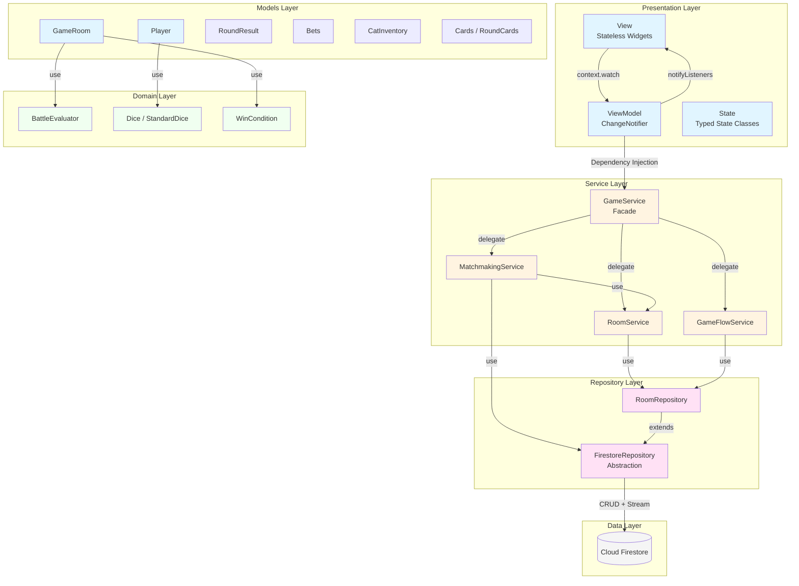
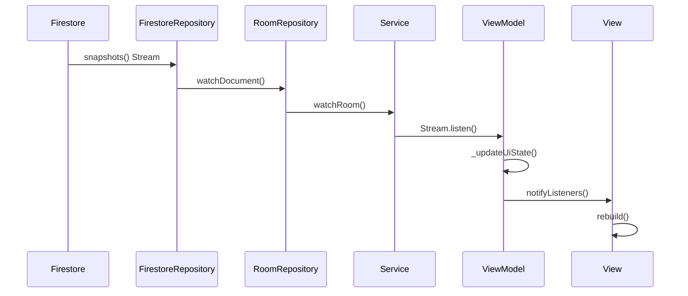
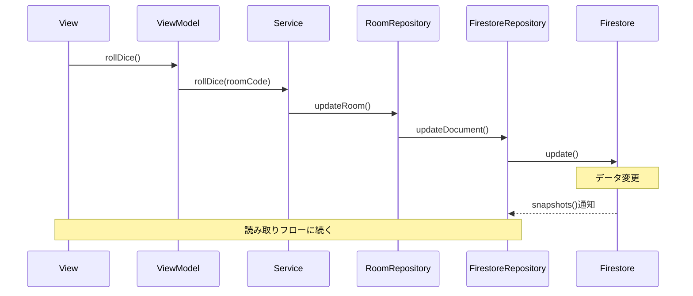

# アーキテクチャ概要

## 5層アーキテクチャ構成

このプロジェクトは、Clean Architectureの原則に基づいた5層構造を採用しています。



## 各層の責務

### 1. Presentation Layer（プレゼンテーション層）

**責務**: UI表示とユーザー操作の処理

**構成要素**:
- **View**: Statelessな画面ウィジェット
  - `HomeScreen`, `GameScreen`
  - `MainMenuView`, `MatchmakingView`
  - `WaitingView`, `RollingPhaseView`, `BettingPhaseView`, `RoundResultView`, `FinalResultView`
- **ViewModel**: ビジネスロジックと状態管理
  - `HomeScreenViewModel`
  - `GameScreenViewModel`
  - `ChangeNotifier`を継承
  - Serviceレイヤーへの依存性注入
- **State**: 型安全な状態表現
  - `HomeScreenState` (Idle, Loading, Matchmaking)
  - `GameScreenState` (Loading, Waiting, Rolling, Playing, RoundResult, Finished)

**パターン**:
- MVVM (Model-View-ViewModel)
- State Pattern (型安全な状態管理)
- Observer Pattern (Provider + ChangeNotifier)

---

### 2. Service Layer（サービス層）

**責務**: ユースケースの実現とワークフローの制御

**構成要素**:
- **GameService**: 画面から利用される唯一の窓口（Facade）
- **RoomService**: 部屋の作成、参加などのライフサイクル管理
- **MatchmakingService**: 待機リストへの登録とマッチングロジック
- **GameFlowService**: サイコロ、ベット、ターン進行などのゲーム進行制御

**パターン**:
- Facade Pattern (GameService)
- Transaction Control (マッチング処理、次ターン遷移)
- Dependency Injection (全サービス)

---

### 3. Domain Layer（ドメイン層）

**責務**: 純粋なビジネスロジック（永続化や外部に依存しない）

**構成要素**:
- **BattleEvaluator**: 各猫について、賭け金とコストを比較して勝敗を判定
- **Dice**: サイコロを振るインターフェースと標準的な実装（StandardDice）
- **WinCondition**: 勝利条件の判定ロジック（StandardWinCondition）

**特徴**:
- インターフェースによる抽象化
- テスタビリティが高い
- 純粋な計算ロジック

---

### 4. Models Layer（モデル層）

**責務**: データの構造定義と自己完結したロジック

**構成要素**:
- **GameRoom**: 部屋の状態、ホスト/ゲストの保持、ラウンド判定の統括
- **Player**: 魚の数、獲得した猫、サイコロ、確認フラグなどを保持
- **RoundResult**: 特定のラウンドの結果（猫、勝者、賭け金）を保持
- **Bets**: 猫への賭け金情報をカプセル化
- **CatInventory**: 獲得した猫のコレクション管理
- **Cards**: 猫カードの種類やコスト、エフェクトなどの静的データ

**特徴**:
- Firestoreドキュメントとの相互変換 (`toMap`, `fromMap`)
- 自身の状態を変更するメソッド（カプセル化）

---

### 5. Repository Layer（リポジトリ層）

**責務**: 永続化されたデータの管理

**構成要素**:
- **Cloud Firestore**: NoSQLデータベース
  - リアルタイム同期
  - `snapshots()` Streamによる変更監視

---

## データフロー

### 読み取りフロー（リアルタイム同期）



### 書き込みフロー（ユーザー操作）



---

## 採用デザインパターン

| パターン | 適用箇所 | 目的 |
|---------|---------|------|
| **MVVM** | Presentation層 | UIとロジックの分離 |
| **State Pattern** | State classes | 型安全な状態管理 |
| **Facade Pattern** | GameService | 統一インターフェース |
| **Repository Pattern** | Repository層 | データアクセス抽象化 |
| **Dependency Injection** | 全層 | テスタビリティ向上 |
| **Observer Pattern** | Provider + Stream | リアルタイム同期 |
| **Factory Pattern** | State constructors | 状態オブジェクト生成 |

---

## リアルタイム同期の仕組み

ViewModelは初期化時にFirestoreのStream監視を開始します：

```dart
// GameScreenViewModel._init()
_roomSubscription = _gameService.watchRoom(roomCode).listen(
  (room) {
    _currentRoom = room;        // ① 最新データを保持
    _updateUiState(room);       // ② UI状態を判定
    _checkTurnChange(room);     // ③ ターン変更をチェック
    notifyListeners();          // ④ Viewに通知
  }
);
```

これにより、Firestoreのデータが変更されると自動的にUIが更新されます。

---

## アーキテクチャの利点

### 1. **テスタビリティ**
- 各層が独立しているため、モックを使った単体テストが容易
- Domain層は純粋関数のため、テストが簡単

### 2. **保守性**
- 責務が明確に分離されている
- 1ファイルあたり50〜200行程度で管理しやすい

### 3. **拡張性**
- 新機能追加時、影響範囲が限定的
- Repositoryを差し替えることで、Firestore以外のDBに変更可能

### 4. **型安全性**
- State Patternにより、存在しない状態への遷移を防止
- コンパイル時に多くのエラーを検出

### 5. **リアルタイム対応**
- Stream-based architectureにより、自然にリアルタイム同期を実現
- ポーリング不要で効率的

---

## 関連ドキュメント

- [02_mvvm_home.md](./02_mvvm_home.md) - HomeScreenのMVVM構造
- [03_mvvm_game.md](./03_mvvm_game.md) - GameScreenのMVVM構造
- [04_class_diagram.md](./04_class_diagram.md) - クラス関係図
- [05_data_flow.md](./05_data_flow.md) - データフロー詳細
- [06_file_structure.md](./06_file_structure.md) - ファイル構成
