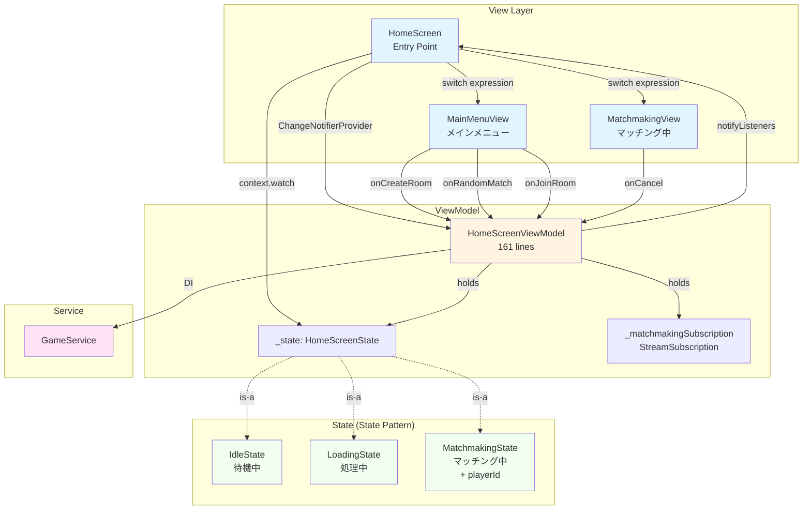
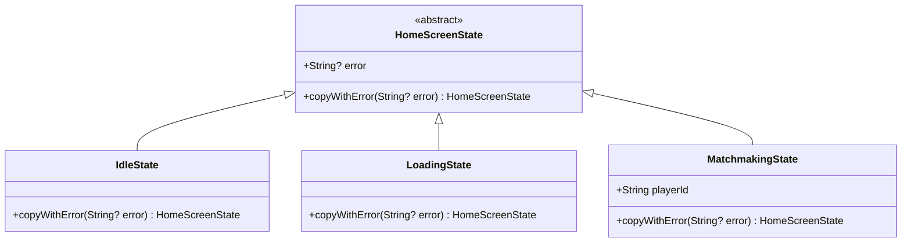
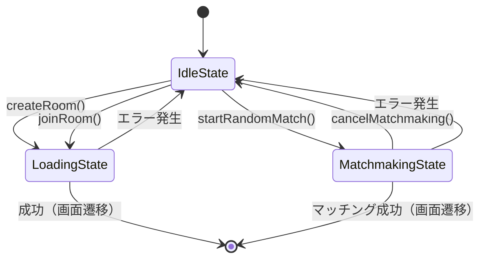
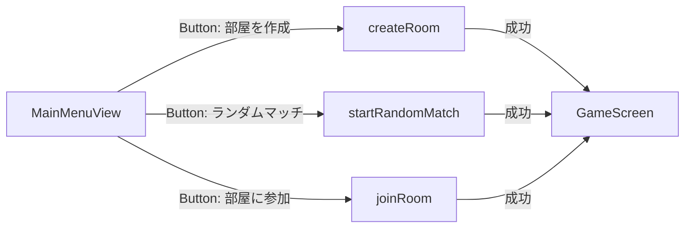
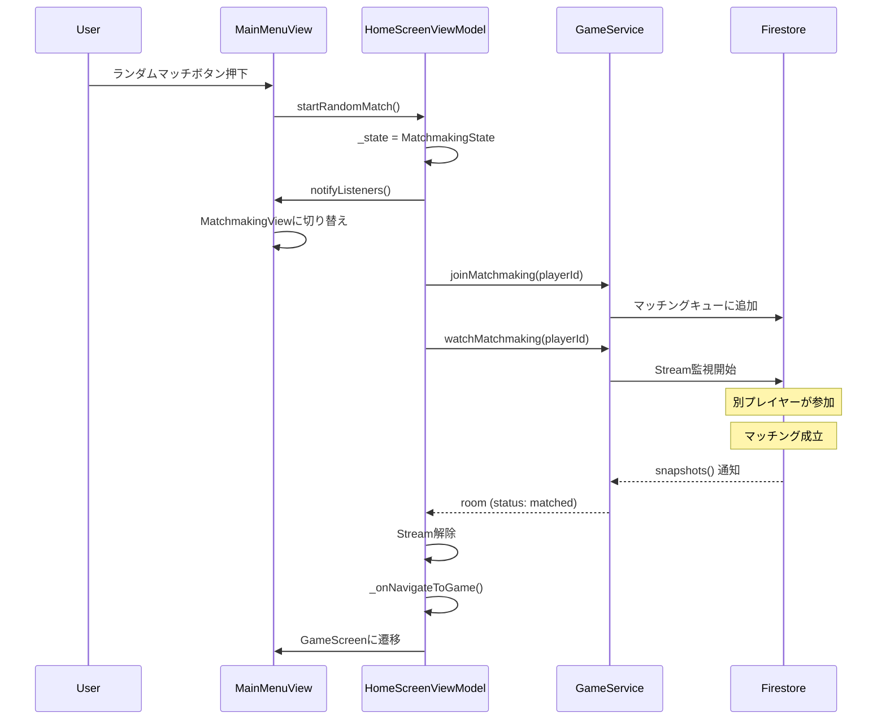
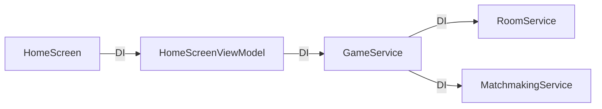

# HomeScreen MVVM構造

## 概要

HomeScreenは、ゲームの開始画面（メインメニュー、部屋作成、ランダムマッチング、部屋参加）を担当します。

---

## MVVM構成図



---

## ファイル構成

```
lib/screens/home/
├── home_screen.dart              (62 lines)   - Entry Point
├── home_screen_view_model.dart   (161 lines)  - ViewModel
├── home_screen_state.dart        (46 lines)   - State Classes
└── views/
    ├── main_menu_view.dart       (106 lines)  - メインメニューUI
    └── matchmaking_view.dart     (51 lines)   - マッチング中UI
```

---

## State Pattern

### 状態クラス階層



### 状態遷移図



---

## ViewModelの主要メソッド

### 1. 部屋作成 (createRoom)

```dart
Future<void> createRoom() async {
  _state = LoadingState();
  notifyListeners();
  
  try {
    final roomCode = await _gameService.createRoom();
    _onNavigateToGame?.call(roomCode, true);
  } catch (e) {
    _state = IdleState().copyWithError(e.toString());
    notifyListeners();
  }
}
```

**フロー**:
1. `LoadingState`に遷移
2. `GameService.createRoom()`呼び出し
3. 成功 → 画面遷移コールバック実行
4. 失敗 → `IdleState`（エラー付き）に戻る

---

### 2. ランダムマッチング (startRandomMatch)

```dart
Future<void> startRandomMatch() async {
  final playerId = _generatePlayerId();
  _state = MatchmakingState(playerId: playerId);
  notifyListeners();
  
  try {
    await _gameService.joinMatchmaking(playerId);
    
    _matchmakingSubscription = _gameService.watchMatchmaking(playerId).listen(
      (room) {
        if (room?.status == MatchmakingStatus.matched) {
          _matchmakingSubscription?.cancel();
          _onNavigateToGame?.call(room!.roomCode, room.hostId == playerId);
        }
      },
    );
  } catch (e) {
    _state = IdleState().copyWithError(e.toString());
    notifyListeners();
  }
}
```

**フロー**:
1. プレイヤーIDを生成
2. `MatchmakingState`に遷移
3. マッチングキューに参加
4. **Stream監視開始**（マッチング待機）
5. マッチング成功時 → Stream解除 & 画面遷移
6. エラー時 → `IdleState`（エラー付き）に戻る

**ポイント**: リアルタイムでマッチング状態を監視

---

### 3. 部屋参加 (joinRoom)

```dart
Future<void> joinRoom(String roomCode) async {
  _state = LoadingState();
  notifyListeners();
  
  try {
    await _gameService.joinRoom(roomCode);
    _onNavigateToGame?.call(roomCode, false);
  } catch (e) {
    _state = IdleState().copyWithError(e.toString());
    notifyListeners();
  }
}
```

**フロー**:
1. `LoadingState`に遷移
2. `GameService.joinRoom(roomCode)`呼び出し
3. 成功 → 画面遷移コールバック実行
4. 失敗 → `IdleState`（エラー付き）に戻る

---

### 4. マッチングキャンセル (cancelMatchmaking)

```dart
Future<void> cancelMatchmaking() async {
  if (_state is! MatchmakingState) return;
  
  final playerId = (_state as MatchmakingState).playerId;
  
  try {
    await _matchmakingSubscription?.cancel();
    await _gameService.leaveMatchmaking(playerId);
    _state = IdleState();
    notifyListeners();
  } catch (e) {
    _state = IdleState().copyWithError(e.toString());
    notifyListeners();
  }
}
```

**フロー**:
1. Stream監視を停止
2. マッチングキューから退出
3. `IdleState`に戻る

---

## View層の実装

### HomeScreen (Entry Point)

```dart
@override
Widget build(BuildContext context) {
  return ChangeNotifierProvider(
    create: (_) => HomeScreenViewModel(
      gameService: context.read<GameService>(),
      onNavigateToGame: (roomCode, isHost) {
        Navigator.push(context, MaterialPageRoute(
          builder: (_) => GameScreen(roomCode: roomCode, isHost: isHost),
        ));
      },
    ),
    child: Consumer<HomeScreenViewModel>(
      builder: (context, viewModel, _) {
        final state = viewModel.state;
        
        // エラー表示
        if (state.error != null) {
          WidgetsBinding.instance.addPostFrameCallback((_) {
            ScaffoldMessenger.of(context).showSnackBar(
              SnackBar(content: Text(state.error!)),
            );
          });
        }
        
        // 状態に応じたView選択
        return switch (state) {
          IdleState() => MainMenuView(),
          LoadingState() => Center(child: CircularProgressIndicator()),
          MatchmakingState() => MatchmakingView(),
        };
      },
    ),
  );
}
```

**ポイント**:
- `ChangeNotifierProvider`でViewModelを提供
- `Consumer`で状態変化を監視
- Switch expressionで型安全なView選択
- エラーはSnackBarで表示

---

### MainMenuView



**UI要素**:
- 部屋作成ボタン → `viewModel.createRoom()`
- ランダムマッチボタン → `viewModel.startRandomMatch()`
- 部屋コード入力 + 参加ボタン → `viewModel.joinRoom(code)`

---

### MatchmakingView

**UI要素**:
- マッチング中メッセージ
- `CircularProgressIndicator`（ローディング表示）
- キャンセルボタン → `viewModel.cancelMatchmaking()`

---

## データフロー例: ランダムマッチング



---

## 依存性注入



**利点**:
- ViewModelは具象クラスに依存しない
- テスト時にモックを注入可能
- Service層の変更がViewModelに影響しない

---

## エラーハンドリング

### 1. エラー発生時の状態遷移

```dart
catch (e) {
  _state = IdleState().copyWithError(e.toString());
  notifyListeners();
}
```

### 2. View側でのエラー表示

```dart
if (state.error != null) {
  WidgetsBinding.instance.addPostFrameCallback((_) {
    ScaffoldMessenger.of(context).showSnackBar(
      SnackBar(content: Text(state.error!)),
    );
  });
}
```

**ポイント**:
- エラーはStateオブジェクトに保持
- `addPostFrameCallback`でbuild中のエラー回避
- エラー表示後も現在の状態を維持

---

## メモリ管理

```dart
@override
void dispose() {
  _matchmakingSubscription?.cancel();
  super.dispose();
}
```

ViewModelが破棄される際、必ずStream監視を解除してメモリリークを防止。

---

## 関連ドキュメント

- [01_overview.md](./01_overview.md) - アーキテクチャ概要
- [03_mvvm_game.md](./03_mvvm_game.md) - GameScreenのMVVM構造
- [05_data_flow.md](./05_data_flow.md) - データフロー詳細
