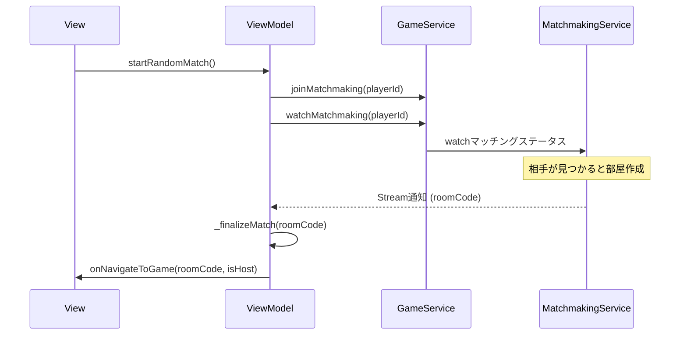

# MVVM詳細: HomeScreen

## 構成

- **View**: `HomeScreen`
  - サブビュー: `MainMenuView`, `MatchmakingView`
- **ViewModel**: `HomeScreenViewModel`
- **State**: `HomeScreenState` (Idle, Loading, Matchmaking)

## 状態管理 (HomeScreenState)

```dart
sealed class HomeScreenState {
  final String? error;
  // ...
}

class IdleState extends HomeScreenState { ... }
class LoadingState extends HomeScreenState { ... }
class MatchmakingState extends HomeScreenState {
  final String playerId;
  // ...
}
```

## ViewModelの主要メソッド

### 1. 部屋作成 (`createRoom`)
- `_generatePlayerId()` で一時的なIDを発行。
- `GameService.createRoom()` を呼び出し、成功したら `onNavigateToGame` コールバックを実行。

### 2. ランダムマッチング開始 (`startRandomMatch`)
- `GameService.joinMatchmaking()` で待機リストに登録。
- `GameService.watchMatchmaking()` の Stream を購読開始。
- マッチング成立（roomCode取得）時、`_finalizeMatch()` でゲーム画面へ遷移し、購読をキャンセル。

### 3. ルーム参加 (`joinRoom`)
- 入力されたルームコードをバリデーション。
- `GameService.joinRoom()` を呼び出し、成功したらゲーム画面へ遷移。

## データフロー: ランダムマッチング



## エラーハンドリング

- 各メソッド内で `try-catch` を行い、失敗時は `_setError(message)` を通じて `state.error` にメッセージを格納。
- UI側で `state.error` が null でない場合に SnackBar 等で通知。
