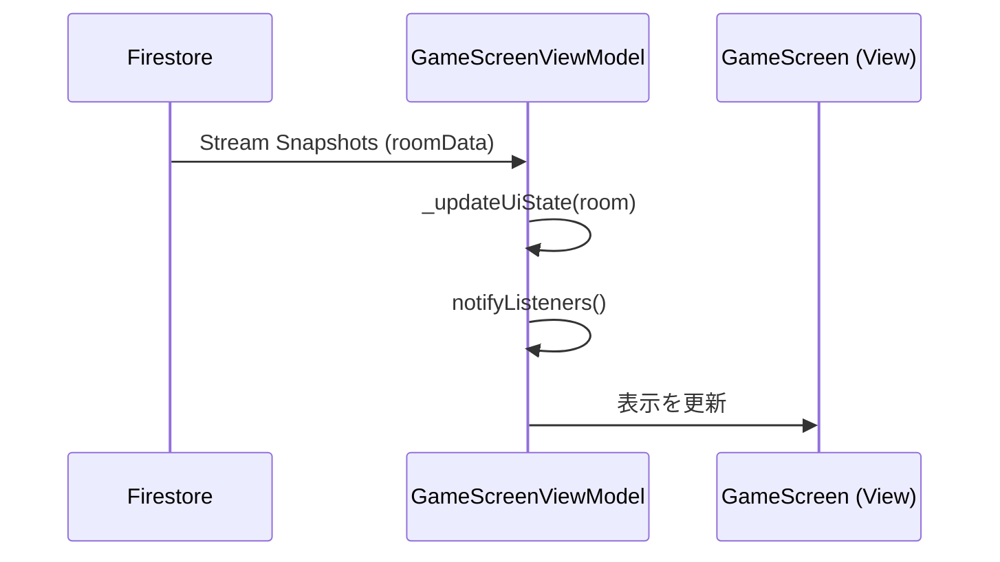

# MVVM詳細: GameScreen

## 構成

- **View**: `GameScreen`
  - サブビュー: `WaitingView`, `RollingPhaseView`, `BettingPhaseView`, `RoundResultView`, `FinalResultView`
- **ViewModel**: `GameScreenViewModel`
- **State**: `GameScreenState`
- **Helper**: `PlayerData`

## 状態遷移ロジック

`GameScreenViewModel` は Firestore からの `GameRoom` ストリームを監視し、以下のルールに基づいて `uiState` を決定します。

1.  **相手の退出チェック**: `abandoned` フラグが立っていれば退出用UIへ。
2.  **個別フェーズ遷移の整合性**:
    - ラウンド結果が未確認なら、`RoundResult` 画面を優先表示。
    - サイコロ確認が未完了なら、`Rolling` 画面を表示。
3.  **GameStatusに基づく基本遷移**:
    - `waiting`: 相手の入室待ち。
    - `rolling`: サイコロフェーズ。
    - `playing`: ベット中。
    - `round_result`: ラウンド結果。
    - `fat_cat_event`: 太っちょネコイベント発生。
    - `finished`: ゲーム終了。

## PlayerData の役割

ViewModelからUIに渡すデータを整理するためのヘルマークラスです。ホスト/ゲストの差異を吸収します。

```dart
class PlayerData {
  final int myFishCount;
  final int opponentFishCount;
  final bool myReady;
  final bool opponentReady;
  // ... getters for UI
}
```

## 主要メソッド

### 1. サイコロ操作 (`rollDice` / `confirmRoll`)
- `rollDice()`: サイコロを振り、`rolled: true` に更新。
- `confirmRoll()`: 結果を確認し、`confirmedRoll: true` に更新。

### 2. ベット操作 (`placeBets`)
- `updateBet()`: ローカル状態の `Bets` を更新。
- `placeBets()`: `ready: true` と共に現在の `Bets` を送信。

### 3. 進行操作 (`nextTurn` / `confirmFatCatEvent`)
- `nextTurn()`: ラウンド結果を確認完了 (`confirmedRoundResult: true`) に更新。
- `confirmFatCatEvent()`: 太っちょネコイベントの確認完了 (`confirmedFatCatEvent: true`) に更新。
- 両者が確認完了すると、ドメイン層の `RoundResolver` を通じて次の状態へ移行。

### 4. 退出操作 (`leaveRoom`)
- **条件付き削除**:
  - ホストが一人で待機中に退出した場合、ルームドキュメントを削除。
  - すでに相手が退出済み (`abandoned: true`) の状態でもう一方が退出した場合、ルームドキュメントを削除。
- **フラグ更新**:
  - 相手がまだルームに残っている場合は、自身の `abandoned` フラグを `true` に更新するのみ。
- **誤表示の抑制**:
  - 自身が退出操作を行った際は `_isExiting` フラグを立て、Firestore からのルーム削除通知や相手の退出フラグを無視して、ダイアログを表示せずにホームへ戻る。

## リアルタイム同期の仕組み



## メモリ管理

- `dispose()` 時に `StreamSubscription` を `cancel()` することを徹底しています。
