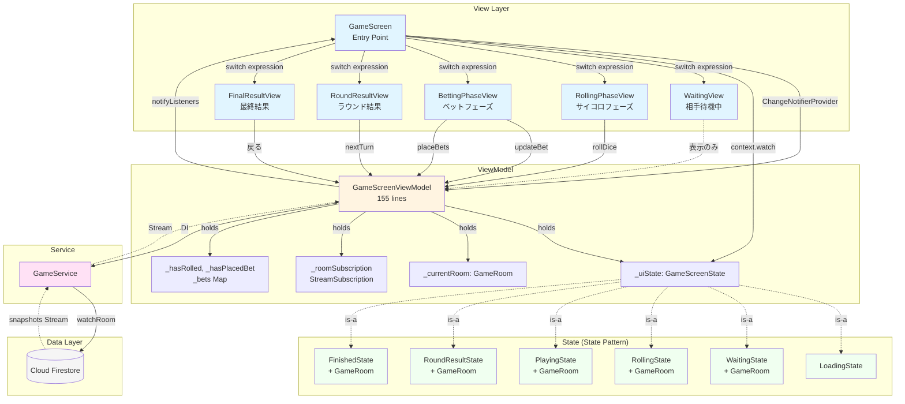
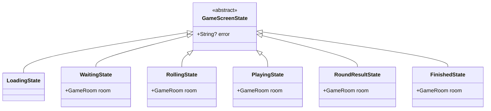
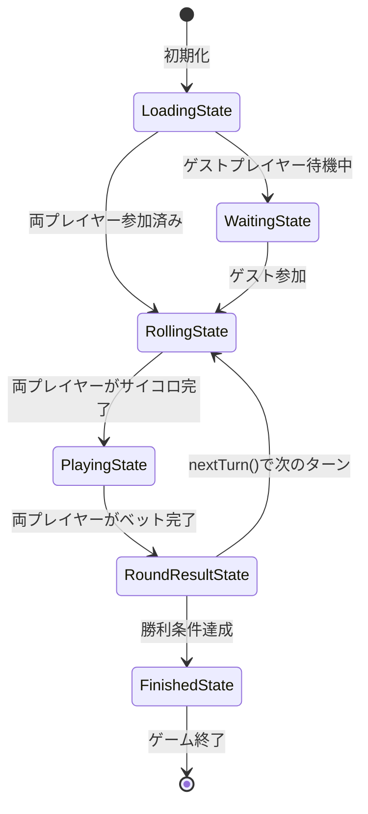
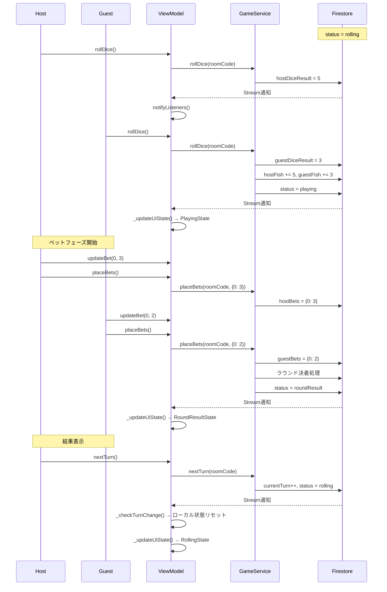

# GameScreen MVVM構造

## 概要

GameScreenは、実際のゲームプレイ画面を担当します。Firestoreとのリアルタイム同期により、対戦相手の操作が即座に反映されます。

---

## MVVM構成図



---

## ファイル構成

```
lib/screens/game/
├── game_screen.dart              (100 lines)  - Entry Point
├── game_screen_view_model.dart   (155 lines)  - ViewModel
├── game_screen_state.dart        (95 lines)   - State Classes
├── player_data.dart              (18 lines)   - Helper Class
└── views/
    ├── waiting_view.dart         (40 lines)   - 相手待機中UI
    ├── rolling_phase_view.dart   (160 lines)  - サイコロUI
    ├── betting_phase_view.dart   (220 lines)  - ベットUI
    ├── round_result_view.dart    (165 lines)  - ラウンド結果UI
    └── final_result_view.dart    (105 lines)  - 最終結果UI
```

---

## State Pattern

### 状態クラス階層



### 状態遷移図



---

## リアルタイム同期の仕組み（最重要）

### Stream監視の初期化

```dart
void _init() {
  _roomSubscription = _gameService.watchRoom(_roomCode).listen(
    (room) {
      _currentRoom = room;        // ① 最新のGameRoomデータを保持
      _updateUiState(room);       // ② UI状態を判定
      _checkTurnChange(room);     // ③ ターン変更をチェック
      notifyListeners();          // ④ Viewに通知
    },
    onError: (error) {
      _uiState = LoadingState().copyWithError(error.toString());
      notifyListeners();
    },
  );
}
```

### UI状態の判定ロジック

```dart
void _updateUiState(GameRoom room) {
  // ゲスト未参加
  if (room.guestId == null) {
    _uiState = WaitingState(room: room);
    return;
  }
  
  // GameStatusに基づいて状態決定
  switch (room.status) {
    case GameStatus.waiting:
      _uiState = WaitingState(room: room);
      
    case GameStatus.rolling:
      _uiState = RollingState(room: room);
      
    case GameStatus.playing:
      _uiState = PlayingState(room: room);
      
    case GameStatus.roundResult:
      _uiState = RoundResultState(room: room);
      
    case GameStatus.finished:
      _uiState = FinishedState(room: room);
  }
}
```

### ターン変更時のローカル状態リセット

```dart
void _checkTurnChange(GameRoom room) {
  if (_previousTurn != null && _previousTurn != room.currentTurn) {
    _resetLocalState();
  }
  _previousTurn = room.currentTurn;
}

void _resetLocalState() {
  _hasRolled = false;
  _hasPlacedBet = false;
  _bets.clear();
}
```

**ポイント**:
- Firestoreのデータ変更が自動的にStreamで通知される
- ViewModelは最新データを受け取り、適切なUI状態に変換
- ターン変更時、ローカルの入力状態をリセット

---

## ViewModelの主要メソッド

### 1. サイコロを振る (rollDice)

```dart
Future<void> rollDice() async {
  if (_hasRolled) return;
  
  try {
    await _gameService.rollDice(_roomCode);
    _hasRolled = true;
    notifyListeners();
  } catch (e) {
    _uiState = _uiState.copyWithError(e.toString());
    notifyListeners();
  }
}
```

**フロー**:
1. 二重実行防止チェック（`_hasRolled`）
2. `GameService.rollDice()`呼び出し → Firestore更新
3. ローカルフラグを立てる
4. Firestoreの変更 → Stream通知 → 自動的にUI更新

---

### 2. ベット更新 (updateBet)

```dart
void updateBet(int catIndex, int amount) {
  _bets[catIndex] = amount;
  notifyListeners();
}
```

**特徴**: ローカル状態のみ更新（Firestoreには送信しない）

---

### 3. ベット確定 (placeBets)

```dart
Future<void> placeBets() async {
  if (_hasPlacedBet) return;
  
  try {
    await _gameService.placeBets(_roomCode, _bets);
    _hasPlacedBet = true;
    notifyListeners();
  } catch (e) {
    _uiState = _uiState.copyWithError(e.toString());
    notifyListeners();
  }
}
```

**フロー**:
1. 二重実行防止チェック
2. `GameService.placeBets()`呼び出し → Firestore更新
3. ローカルフラグを立てる
4. Firestoreの変更 → Stream通知 → 自動的に`RoundResultState`に遷移

---

### 4. 次のターンへ (nextTurn)

```dart
Future<void> nextTurn() async {
  try {
    await _gameService.nextTurn(_roomCode);
  } catch (e) {
    _uiState = _uiState.copyWithError(e.toString());
    notifyListeners();
  }
}
```

**フロー**:
1. `GameService.nextTurn()`呼び出し → Firestore更新
2. Firestoreの変更 → Stream通知 → 自動的に`RollingState`に遷移
3. `_checkTurnChange()`でローカル状態リセット

---

## データフロー例: サイコロ → ベット → 結果



---

## View層の実装

### GameScreen (Entry Point)

```dart
@override
Widget build(BuildContext context) {
  return ChangeNotifierProvider(
    create: (_) => GameScreenViewModel(
      gameService: context.read<GameService>(),
      roomCode: widget.roomCode,
      isHost: widget.isHost,
    ),
    child: Scaffold(
      appBar: AppBar(
        title: Text('ルームコード: ${widget.roomCode}'),
        actions: [
          IconButton(
            icon: Icon(Icons.copy),
            onPressed: () {
              Clipboard.setData(ClipboardData(text: widget.roomCode));
            },
          ),
        ],
      ),
      body: Consumer<GameScreenViewModel>(
        builder: (context, viewModel, _) {
          final state = viewModel.uiState;
          
          // 状態に応じたView選択
          return switch (state) {
            LoadingState() => Center(child: CircularProgressIndicator()),
            WaitingState(:final room) => WaitingView(room: room),
            RollingState(:final room) => RollingPhaseView(
                room: room,
                isHost: widget.isHost,
                viewModel: viewModel,
              ),
            PlayingState(:final room) => BettingPhaseView(
                room: room,
                isHost: widget.isHost,
                viewModel: viewModel,
              ),
            RoundResultState(:final room) => RoundResultView(
                room: room,
                isHost: widget.isHost,
                viewModel: viewModel,
              ),
            FinishedState(:final room) => FinalResultView(room: room),
          };
        },
      ),
    ),
  );
}
```

**ポイント**:
- Switch expressionで型安全なView選択
- Pattern matchingで`room`を抽出
- AppBarにルームコードとコピー機能

---

### 各Viewの役割

| View | 状態 | 役割 | ユーザー操作 |
|------|------|------|------------|
| **WaitingView** | WaitingState | ゲスト待機中の表示 | なし（表示のみ） |
| **RollingPhaseView** | RollingState | サイコロを振る | `rollDice()`ボタン |
| **BettingPhaseView** | PlayingState | 猫にベットする | `updateBet()`, `placeBets()` |
| **RoundResultView** | RoundResultState | ラウンド結果表示 | `nextTurn()`ボタン |
| **FinalResultView** | FinishedState | 最終結果表示 | ホームに戻るボタン |

---

## ローカル状態管理

### なぜローカル状態が必要か？

Firestoreに送信する前の**入力中データ**を保持するため。

```dart
// ローカル状態（Firestoreには保存されない）
bool _hasRolled = false;           // サイコロを振ったか
bool _hasPlacedBet = false;        // ベットを確定したか
Map<int, int> _bets = {};          // 各猫へのベット数（入力中）

// Firestoreから取得する状態
GameRoom _currentRoom;             // 最新のゲームデータ
```

### ターン変更時のリセット

```dart
void _checkTurnChange(GameRoom room) {
  if (_previousTurn != null && _previousTurn != room.currentTurn) {
    _resetLocalState();  // ← 新しいターンでは入力状態をクリア
  }
  _previousTurn = room.currentTurn;
}
```

---

## PlayerDataヘルパークラス

```dart
class PlayerData {
  final int fish;
  final int? diceResult;
  final Map<int, int> bets;
  final List<String> collectedCats;
  
  PlayerData({
    required this.fish,
    this.diceResult,
    required this.bets,
    required this.collectedCats,
  });
  
  factory PlayerData.fromRoom(GameRoom room, bool isHost) {
    return isHost
        ? PlayerData(
            fish: room.hostFish,
            diceResult: room.hostDiceResult,
            bets: room.hostBets,
            collectedCats: room.hostCollectedCats,
          )
        : PlayerData(
            fish: room.guestFish ?? 0,
            diceResult: room.guestDiceResult,
            bets: room.guestBets ?? {},
            collectedCats: room.guestCollectedCats ?? [],
          );
  }
}
```

**目的**: ホスト/ゲストの切り替えロジックをView層から隠蔽

---

## エラーハンドリング

### 1. Stream監視中のエラー

```dart
_roomSubscription = _gameService.watchRoom(_roomCode).listen(
  (room) { /* ... */ },
  onError: (error) {
    _uiState = LoadingState().copyWithError(error.toString());
    notifyListeners();
  },
);
```

### 2. 操作実行時のエラー

```dart
try {
  await _gameService.rollDice(_roomCode);
} catch (e) {
  _uiState = _uiState.copyWithError(e.toString());
  notifyListeners();
}
```

---

## メモリ管理

```dart
@override
void dispose() {
  _roomSubscription?.cancel();  // Stream監視を解除
  super.dispose();
}
```

**重要**: ViewModelが破棄される際、必ずStreamを解除してメモリリークを防止。

---

## リアルタイム同期の利点

### 1. ポーリング不要
- Firestoreが変更を自動通知
- サーバー負荷が低い

### 2. 即座に反映
- 相手の操作が瞬時にUI更新
- 対戦ゲームに最適

### 3. コードがシンプル
- 「データを取得してUI更新」のロジックが一箇所（`_init()`）
- 各操作メソッドは「Firestoreに書き込むだけ」

---

## 関連ドキュメント

- [01_overview.md](./01_overview.md) - アーキテクチャ概要
- [02_mvvm_home.md](./02_mvvm_home.md) - HomeScreenのMVVM構造
- [04_class_diagram.md](./04_class_diagram.md) - クラス関係図
- [05_data_flow.md](./05_data_flow.md) - データフロー詳細
