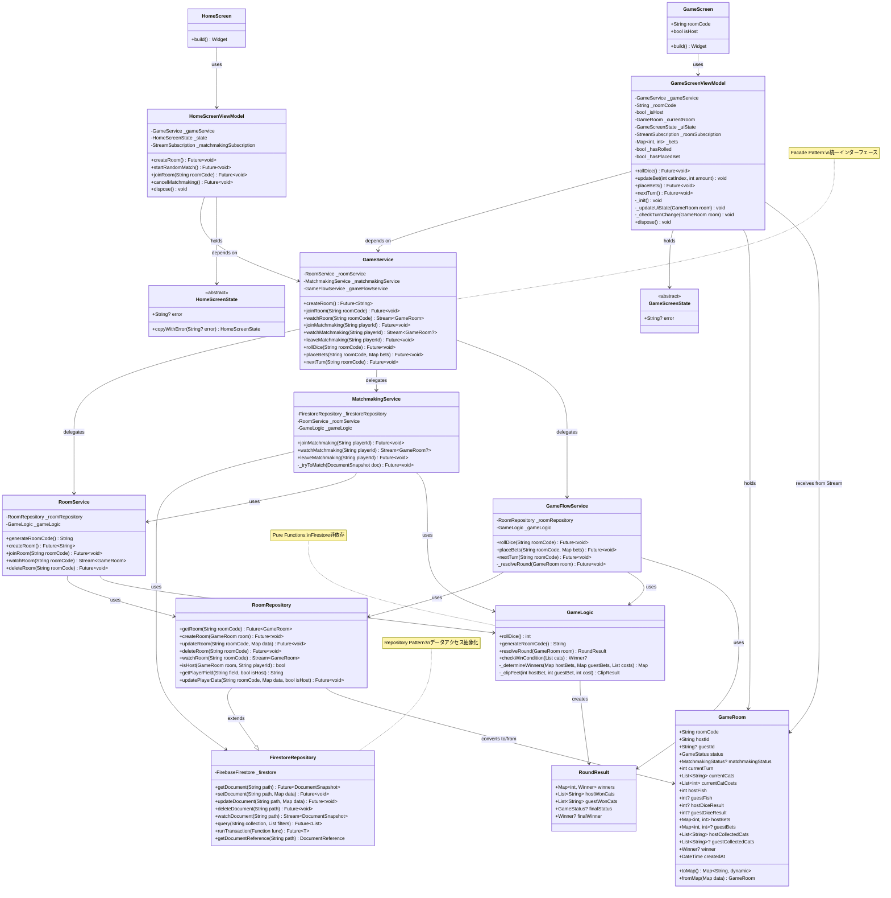
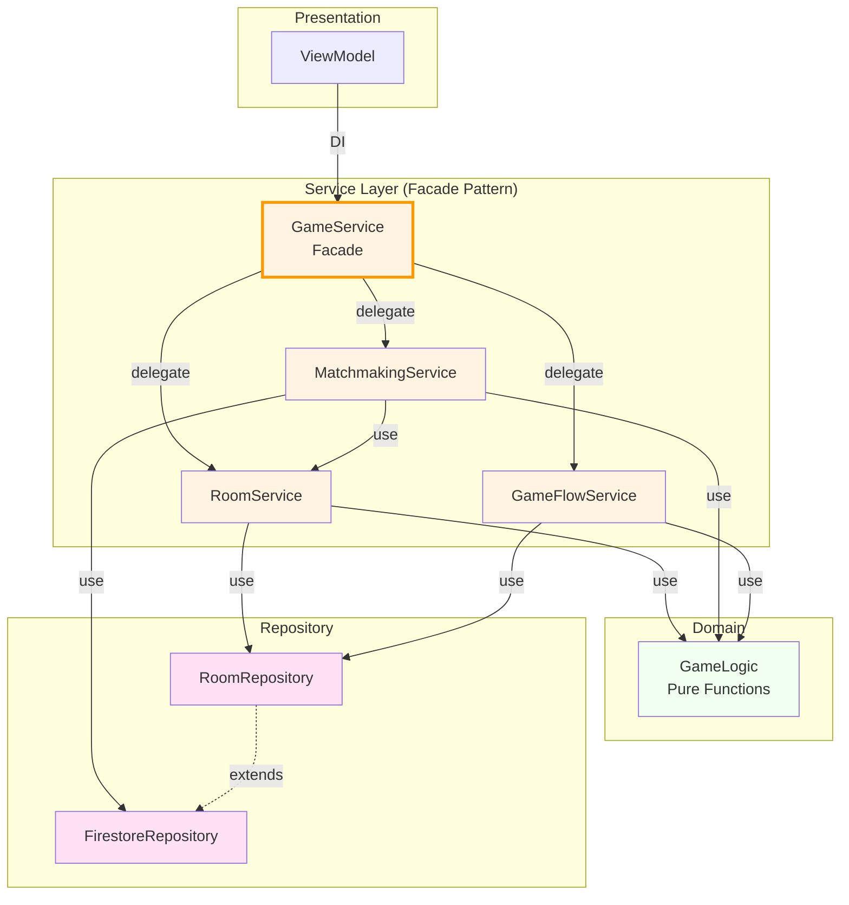
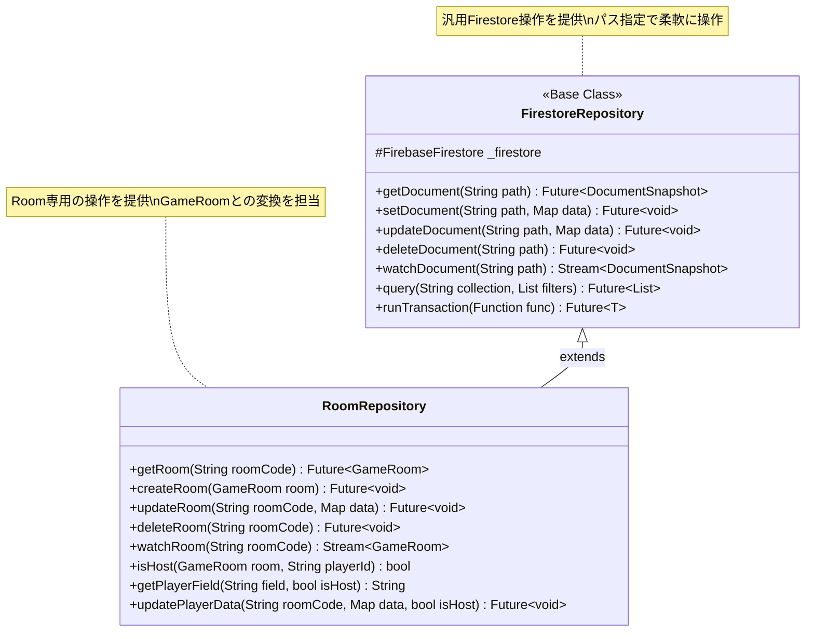
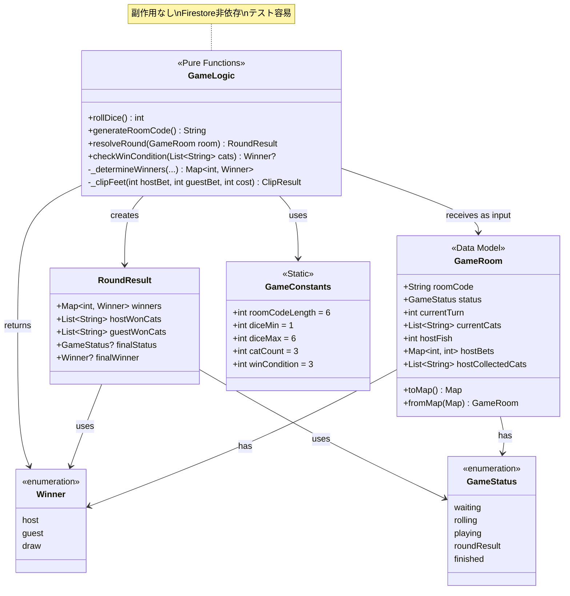
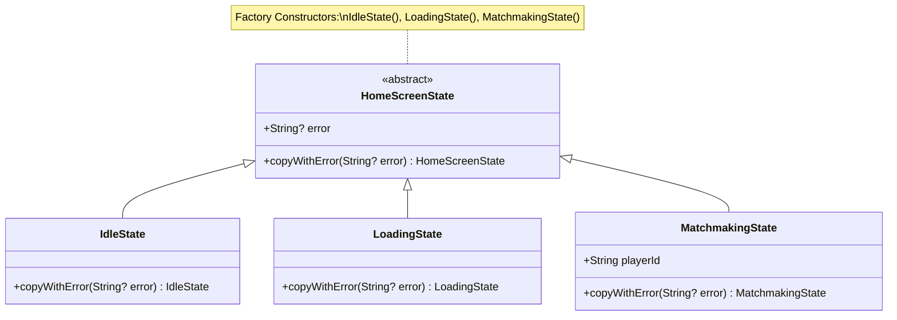
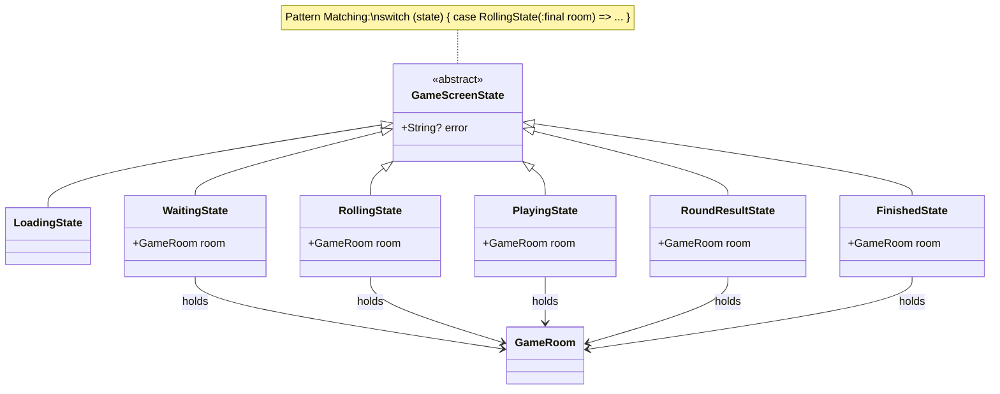
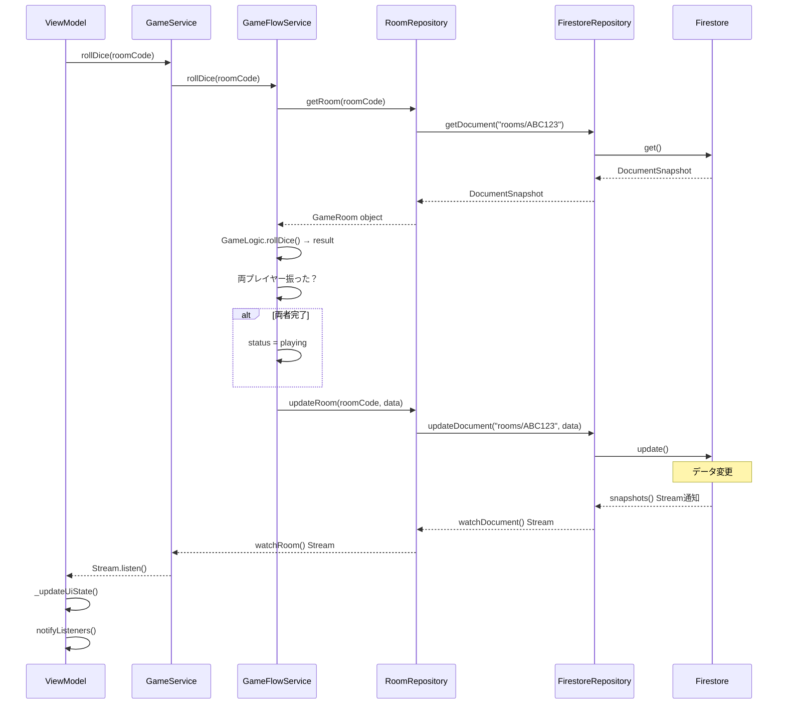
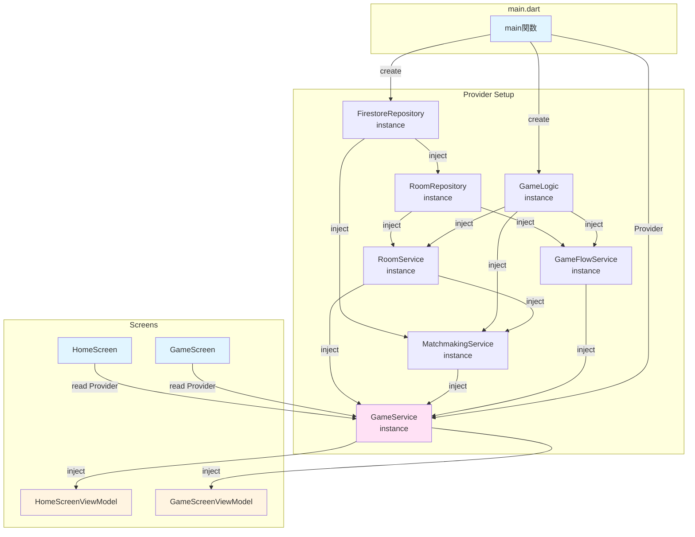

# クラス関係図

## 概要

このドキュメントでは、プロジェクト内の主要クラス間の関係を図示します。

---

## 全体クラス関係図

---

## Service層の依存関係

---

## Repository層の継承関係

**利点**:
- `RoomRepository`は`FirestoreRepository`の汎用メソッドを継承
- `rooms/`コレクション専用のヘルパーメソッドを追加
- `GameRoom`モデルとの変換ロジックを集約

---

## Domain層のクラス

---

## State Patternの実装

### HomeScreenState

### GameScreenState

---

## ViewModel - Service - Repository の詳細フロー

---

## 依存性注入の流れ

**ポイント**:
- 全ての依存は`main.dart`で生成
- `MultiProvider`でツリーに提供
- 各クラスはコンストラクタで依存を受け取る
- テスト時にモック注入が容易

---

## 関連ドキュメント

- [01_overview.md](./01_overview.md) - アーキテクチャ概要
- [02_mvvm_home.md](./02_mvvm_home.md) - HomeScreenのMVVM構造
- [03_mvvm_game.md](./03_mvvm_game.md) - GameScreenのMVVM構造
- [05_data_flow.md](./05_data_flow.md) - データフロー詳細
- [06_file_structure.md](./06_file_structure.md) - ファイル構成
