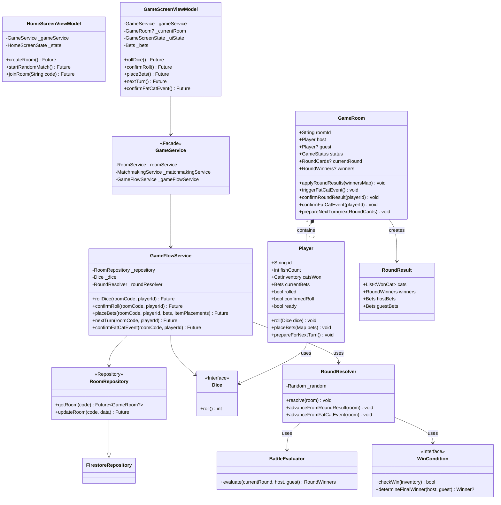
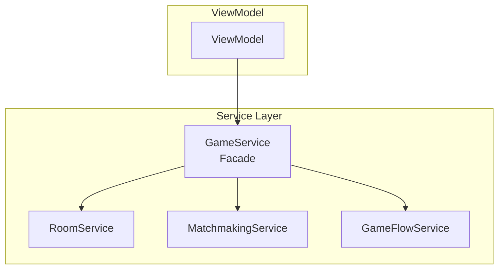
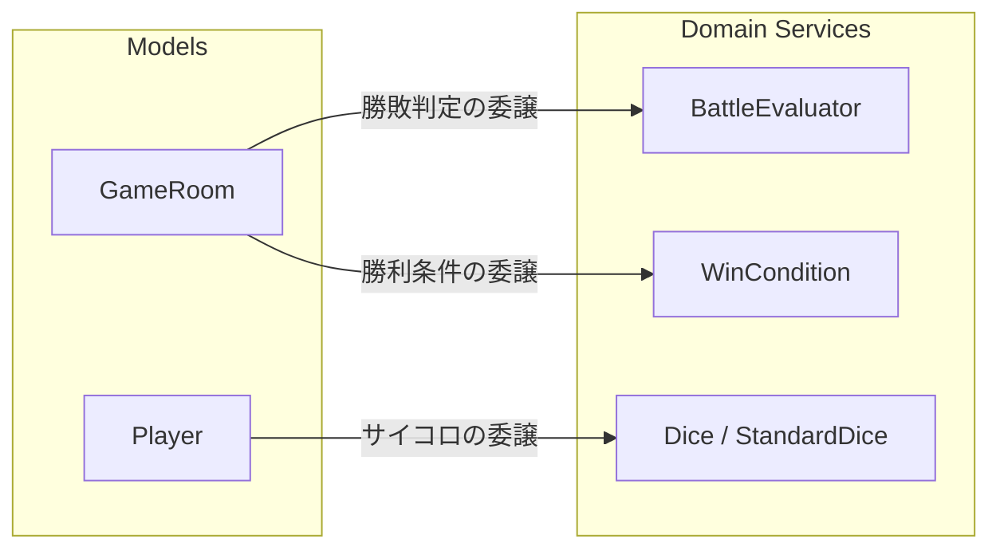
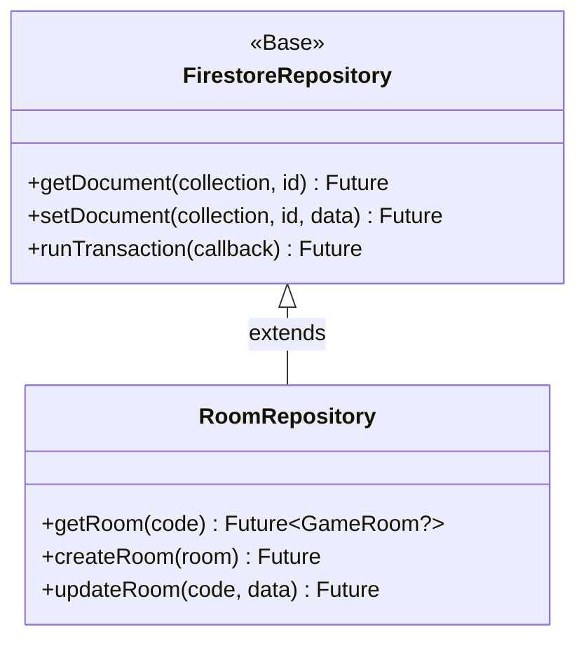

# クラス詳細設計

本作は、MVVMパターン、Facadeパターン、およびRepositoryパターンを採用し、責務の分離を徹底しています。

## 全体クラス図

---

## サービス層の構成（Facadeパターン）

プレゼンテーション層（ViewModel）は `GameService` を通じてのみ、下層のサービスを呼び出します。

---

## ドメイン・モデル層の相互作用

`GameRoom` はドメインサービス（`BattleEvaluator`, `WinCondition`）を利用して、ラウンドの状態を更新します。

---

## リポジトリ層の継承関係

