# データフロー詳細

## 概要

このドキュメントでは、プロジェクト内の主要なデータフローをシナリオ別に図示します。

---

## 1. 部屋作成フロー

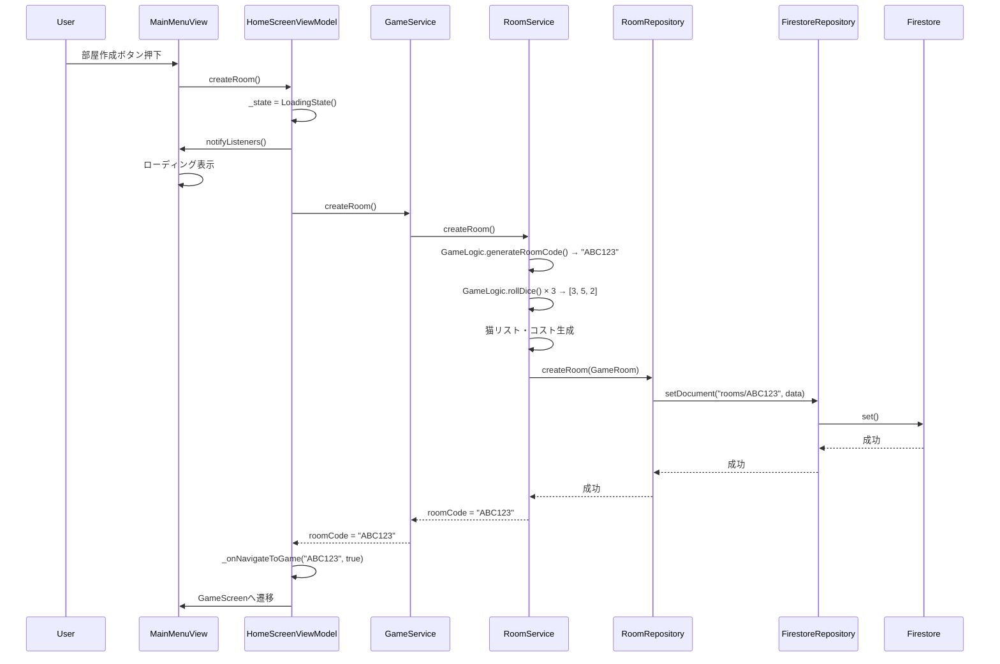

**ポイント**:
- 部屋コードはランダム生成（6桁英数字）
- 初期の猫・コストもランダム
- ホストとして部屋に入る（`isHost = true`）

---

## 2. ランダムマッチングフロー

### 2.1. マッチング参加

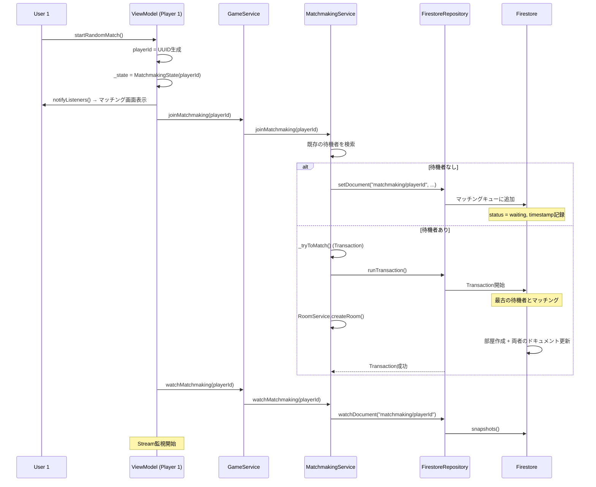

### 2.2. マッチング成立

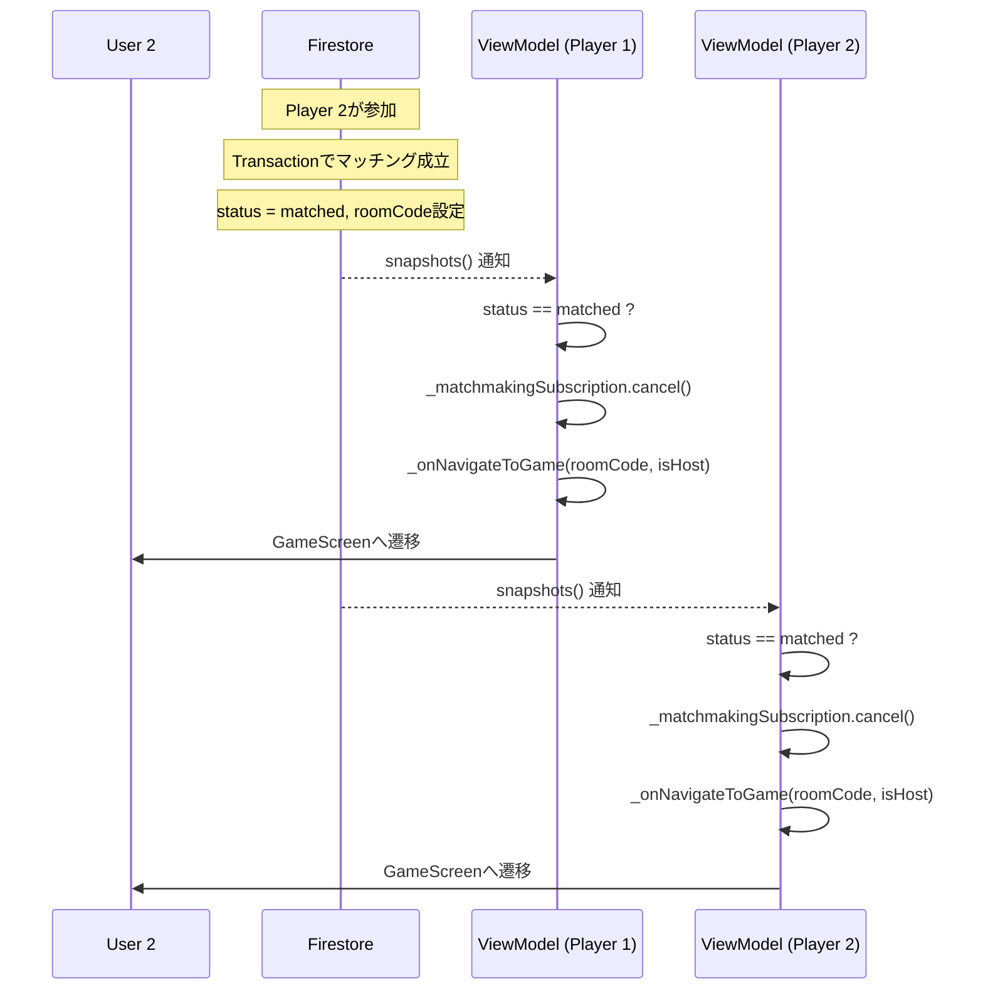

**ポイント**:
- Transactionで競合を防止
- 両プレイヤーが同時にStreamで通知を受け取る
- タイムスタンプ順で最古の待機者とマッチング

---

## 3. 部屋参加フロー

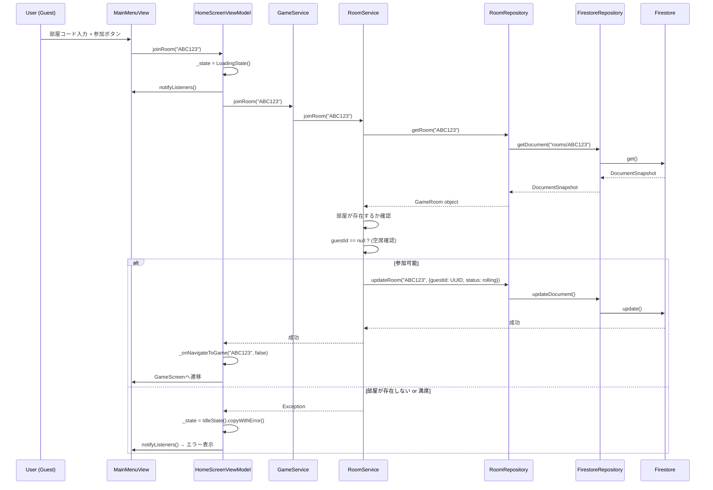

**ポイント**:
- 部屋の存在確認
- 既にゲストがいる場合はエラー
- ゲスト参加と同時に`status = rolling`に変更

---

## 4. ゲームプレイフロー（1ターン）

### 4.1. サイコロフェーズ

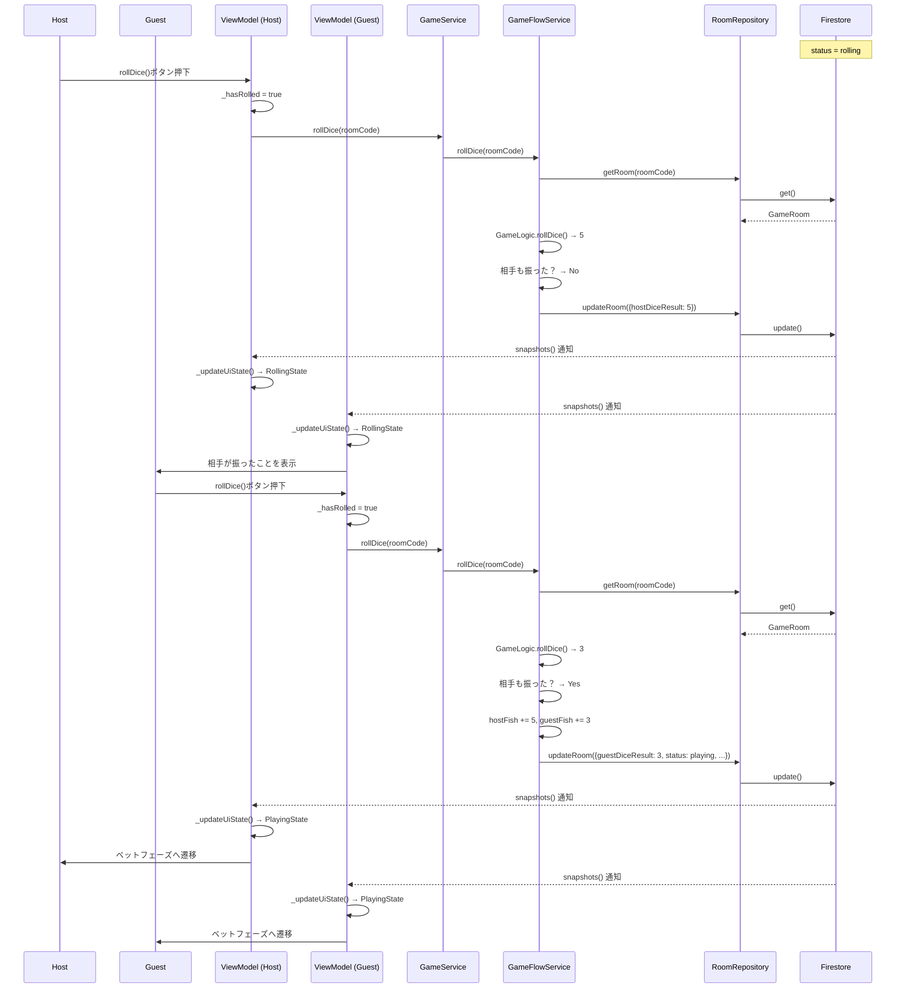

### 4.2. ベットフェーズ

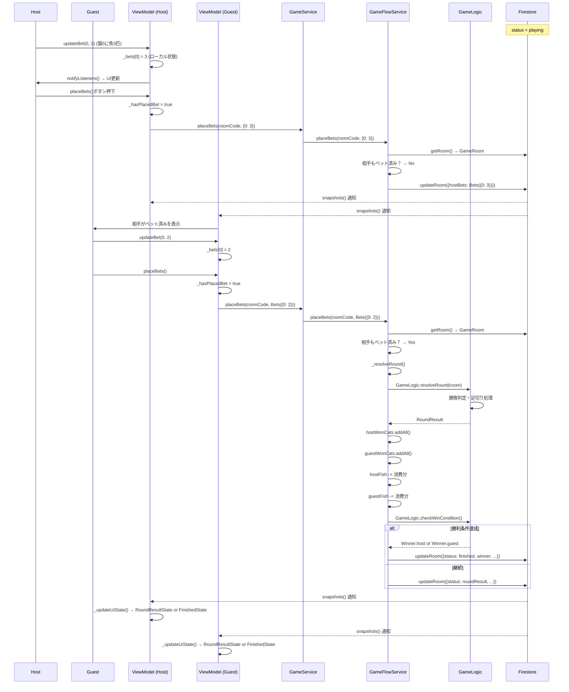

### 4.3. ラウンド結果 → 次のターン

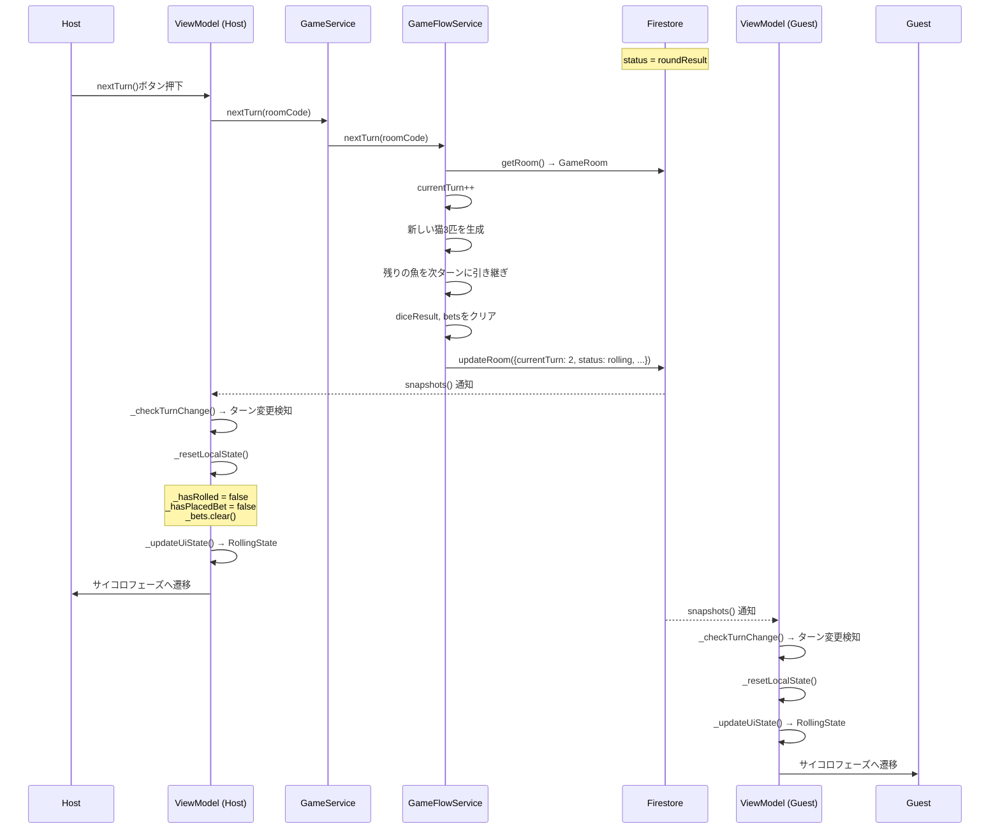

---

## 5. リアルタイム同期の詳細

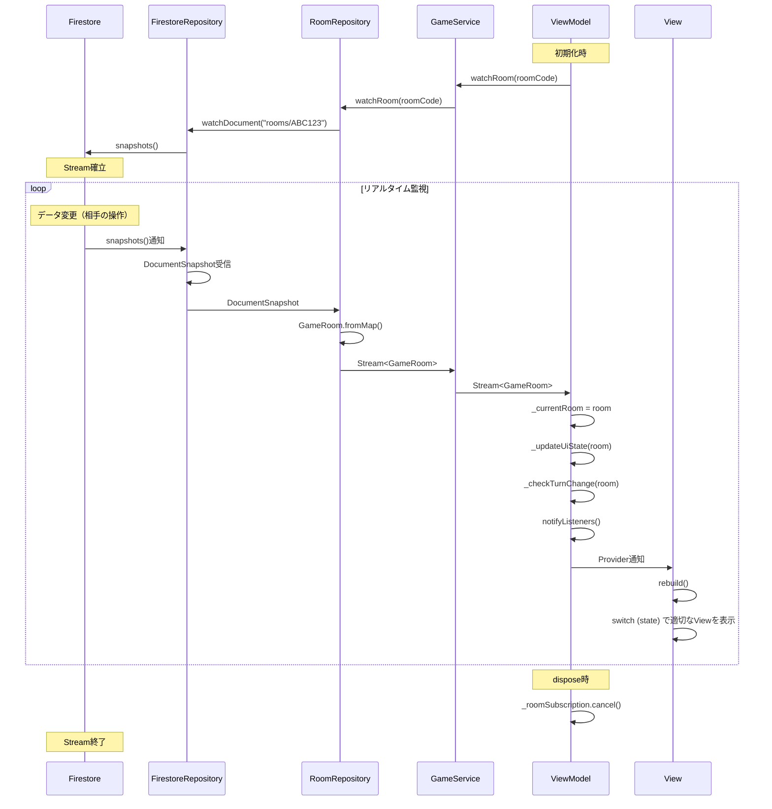

**ポイント**:
- Firestoreの`snapshots()`で自動監視
- データ変更が即座にStreamで通知
- ポーリング不要で効率的
- ViewModelが状態判定を一元管理

---

## 6. エラーハンドリングフロー

### 6.1. Service層でのエラー

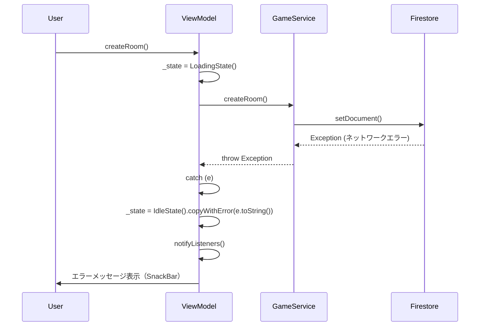

### 6.2. Stream監視中のエラー

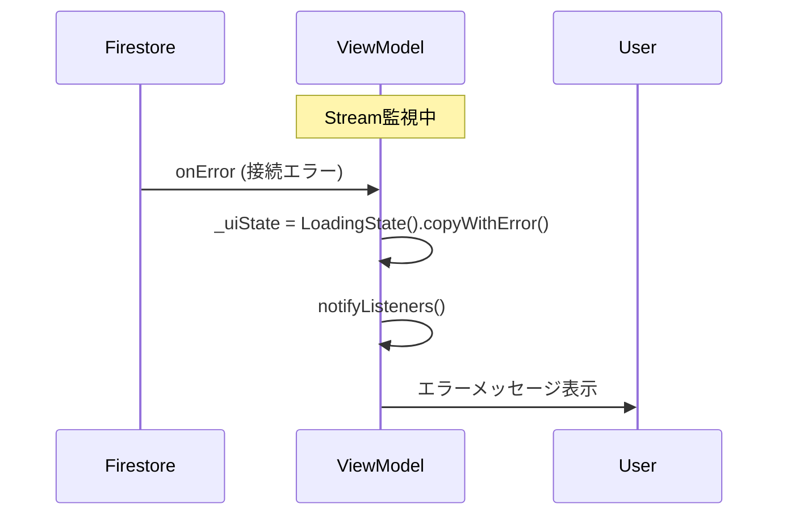

---

## 7. メモリ管理フロー

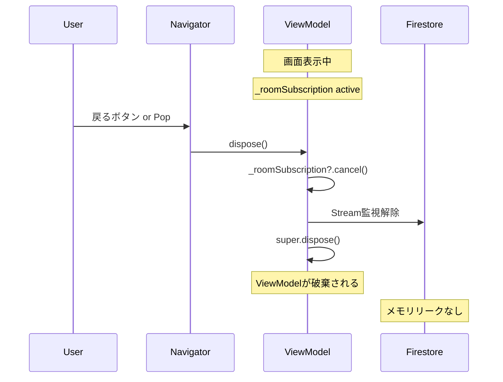

**重要**: 必ず`dispose()`でStreamを解除

---

## 8. 依存性注入フロー

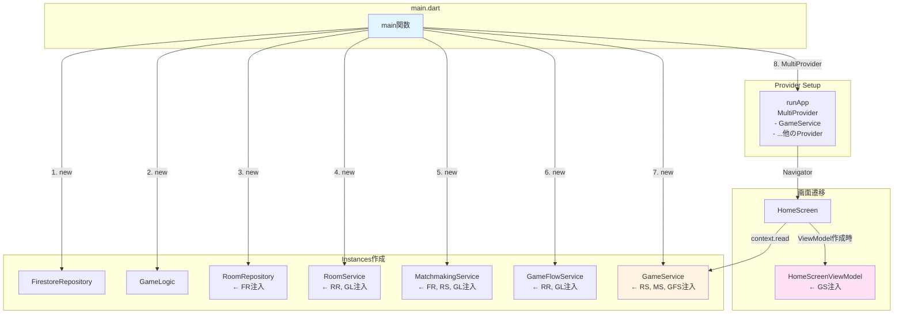

---

## 関連ドキュメント

- [01_overview.md](./01_overview.md) - アーキテクチャ概要
- [02_mvvm_home.md](./02_mvvm_home.md) - HomeScreenのMVVM構造
- [03_mvvm_game.md](./03_mvvm_game.md) - GameScreenのMVVM構造
- [04_class_diagram.md](./04_class_diagram.md) - クラス関係図
- [06_file_structure.md](./06_file_structure.md) - ファイル構成
