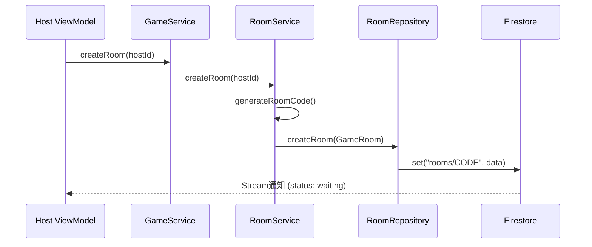
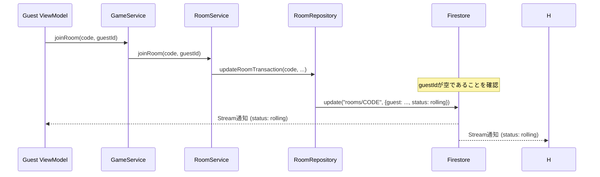
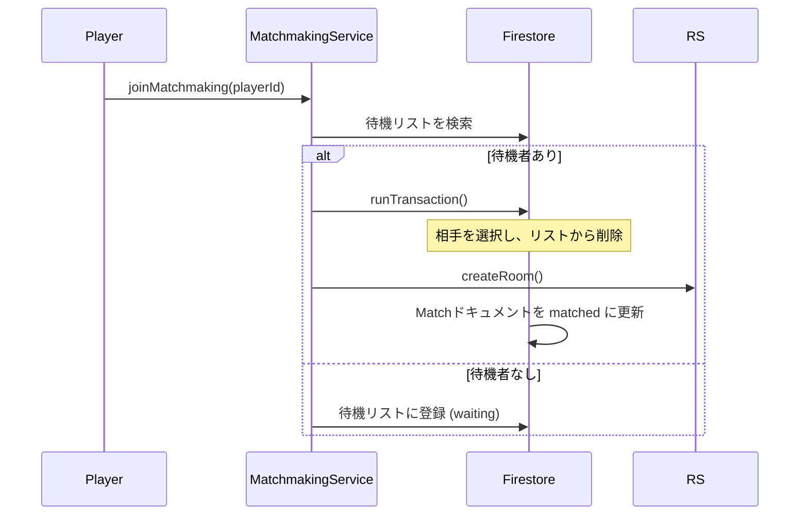
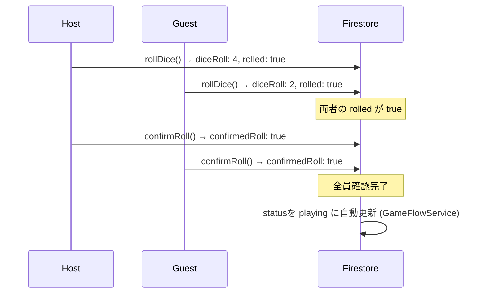
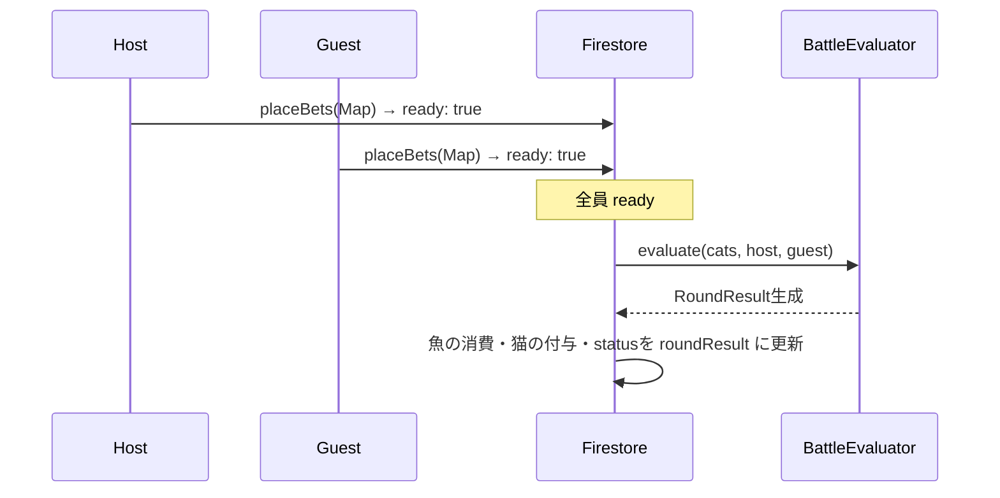
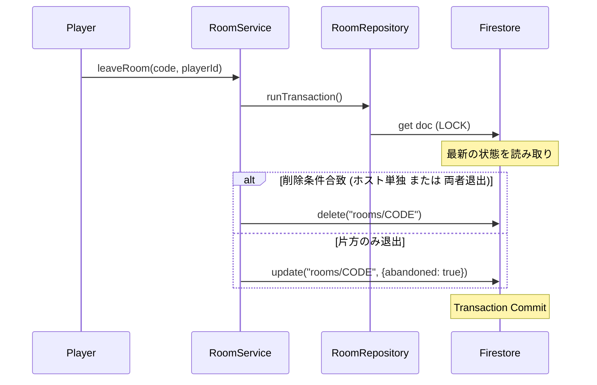
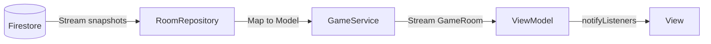

# データフロー詳細

本作の主要なユースケースにおけるデータフローをシーケンス図で示します。

---

## 1. 部屋作成と参加

### 1.1 部屋作成 (Host)
ホストが部屋を作成し、Firestoreに初期状態を保存します。

### 1.2 部屋参加 (Guest)
ゲストがコード入力で参加し、トランザクション安全にプレイヤー情報を更新します。

---

## 2. マッチング (Transaction)

マッチングサービスは `Transaction` を使用し、二重マッチングを防ぎます。

---

## 3. ゲームプレイサイクル

各フェーズは両プレイヤーの「確認フラグ」によって同期されます。

### 3.1 サイコロフェーズ
両プレイヤーがサイコロを振り、結果を「確認」すると次に進みます。

### 3.2 ベットフェーズ
両プレイヤーがベットを「確定」するとラウンド解決が走ります。

### 3.3 退出処理 (Transaction)
レースコンディションを防ぎ、最新の状態に基づいて削除を判定するため、トランザクションを使用します。

---

## 4. リアルタイム同期

全てのレイヤーは `Stream<GameRoom>` を通じて同期しています。

